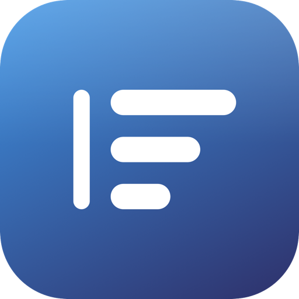

<div align="center">



# InputFlow

**隐私优先的跨平台输入法**

纯本地引擎 · 零服务器 · 零遥测 · 跨端同步走局域网 P2P 端到端加密

[](LICENSE)
[](#-平台)
[](#-架构)
[](#-参与贡献)

</div>

---

> **三个承诺**
>
> 🔒 **你的按键永远不离开你的设备** —— 引擎、词典、学习全部本机运行，安装包可断网使用
> 🙈 **零遥测、零云 API** —— 没有"匿名上报"，没有"联网纠错"，本地 AI 模型由你显式下载
> 🔍 **一切可审计** —— AGPL-3.0 开源，Rust 内核零第三方依赖，插件是数据不是代码

## ✨ 亮点

| | |
|---|---|
| ⌨️ **专业输入引擎** | 全拼 / 双拼×3 · Viterbi 整句转换 · 简拼混拼 · 中英混输 · 20 万词条 |
| 🧠 **按应用记忆中/英** | 本地统计模型学习你的切换习惯：终端自动英文、微信自动中文，Shift 一按即学 |
| 🐾 **有生命的桌宠** | 五种性格的形象，会在你打字时敲键盘/弹古筝，闲时眨眼摆尾，还能追你的鼠标 |
| 📊 **输入统计（零内容）** | 速度、纠错、节省击键、最长发呆、卡路里——只计次与秒，绝不记录任何按键内容 |
| 🧩 **插件 = 数据包** | 皮肤 / 桌宠 / 词典，声明式零代码执行，权限白名单制，装包即放目录 |
| 🛡 **权限中心** | 全部敏感能力集中展示：碰什么数据、存在哪、怎么删，关闭即清空 |
| 💎 **原生体验** | macOS 26 Liquid Glass 玻璃候选窗，旧系统同源设计契约回退 |

## 🐾 桌宠

<p align="center">
  
  &nbsp;&nbsp;&nbsp;
  
</p>

五种性格，各敲各的乐器：**胖橘**踩机械键盘 · **豆豆柴**敲宠物玩具琴 · **铁蛋**打全息屏幕 ·
**墨韵佳人**抚古筝 · **金发淑女**弹钢琴。帧动画（闲时小动作 / 敲击 / 上屏比心 ✨）、
悬停被摸头、左键切中英、右键配置菜单、快启台、傍晚输入小结气泡——
而气泡永远只报本机任务，**永不承载付款与营销**（[边界写在 ADR 里](docs/adr/0006-notifications-and-stats.md)）。

更进阶：内置 VRM 3D 渲染运行时，你的二次元形象可以真的坐在键盘前。

## ⌨️ 输入方案

| 方案 | 状态 |
|---|---|
| 全拼（20 万词条 + Viterbi 整句 + 前缀补全） | ✅ M0 |
| 双拼（小鹤 / 微软 / 自然码） | ✅ M0 |
| 英文（2 万词前缀补全 + 词频） | ✅ M0 |
| 日语（罗马字 → 假名） | ✅ M0 |
| 中英混输（候选融合英文，大写即英文意图） | ✅ M1 |
| 表情模式（连按 `aa`） · 符号输入（`u` 前缀） | ✅ M1 |
| 简繁转换（OpenCC 词表，一键「繁」） | ✅ M1 |
| 日语（假名 → 汉字，JMdict） | ⏳ M2 |

## 🧠 本地 AI 增强（可选，零云 API）

| 层级 | 内容 | 默认 |
|---|---|---|
| L0 统计模型 | 用户词频 + 二元组重排 + 自动短语学习（< 1 MB，随输入学习） | 开启 |
| L1 端上语音 | 系统本地语音识别，不支持则禁用，**绝不回退云端** | 关闭 |
| L2 小模型 | Gemma 3 / Qwen / Whisper 一键下载（sha256 校验，本机运行） | 关闭 |

## 🧩 插件：装包即放目录

```bash
cargo run -p xtask -- plugin new --kind skin --id skin-mine --name 我的皮肤
cargo run -p xtask -- plugin new --kind pet  --id pet-mine  --name 我的桌宠
cargo run -p xtask -- plugin check plugins/skin-mine
```

没有在线市场、没有自动更新、没有可执行代码——包从哪来、信不信，由你决定。
示例包在 [`examples/plugins/`](examples/plugins/)，美术生成器 `genpets.py` 纯标准库可魔改。

## 🚀 快速开始

```bash
cargo test                                  # 内核 161 项测试

# macOS 输入法（Universal：Intel → M 系列，macOS 13+）
./platforms/macos/build.sh                  # 构建自动选用可用签名身份
./platforms/macos/install.sh                # 安装到 ~/Library/Input Methods
```

启用：**系统设置 → 键盘 → 输入法 → + → 中文（简体）→ InputFlow**
（macOS 26 仅收录有效签名；ad-hoc 构建需注销重登录或先配置签名身份）

## 📦 发布分发

```bash
./platforms/macos/dist.sh                   # 签名 → Hardened Runtime → 公证 → DMG → staple
```

签名三级降级：**Developer ID**（公证后任何人双击即用）/ **Apple Development**（本机开发）/
ad-hoc（仅自测）。脚本按证书能力如实标注产物，绝不假装可分发。

## 🗺 平台

| 平台 | 集成 | 状态 |
|---|---|---|
| macOS | InputMethodKit + Liquid Glass | 🚧 M1 |
| Windows / Linux | TSF / Fcitx5 | ⏳ M3 |
| Android / iOS | IMS+JNI / 键盘扩展（无需 Full Access） | ⏳ M4 |
| HarmonyOS NEXT | IME Kit + NAPI | ⏳ M5 |

## 🏗 架构

内核 13 个 crate 全部纯逻辑、可单测，平台前端只做渲染与系统对接：

```
core → dict/pinyin/en/ja/emoji/symbol/zhconv/ai → engine → ffi → 平台前端
                        plugin（皮肤/桌宠/词典数据包）
                        sync（LWW/CRDT，无网络）
```

关键设计决策见 ADR：[本地 AI](docs/adr/0004-local-ai-optional-models.md) ·
[插件体系](docs/adr/0005-plugin-system.md) ·
[提醒与统计边界](docs/adr/0006-notifications-and-stats.md) ·
[桌宠渲染契约](docs/adr/0007-desktop-pet-renderers.md)

## 🔒 隐私承诺

1. 内核不发任何网络请求；前端仅提供可选的局域网同步开关（默认关闭）。
2. 按键缓存只在内存，提交后即清；用户词与剪切板历史 ChaCha20-Poly1305 加密落盘，密钥在系统钥匙串。
3. iOS 不申请 Full Access 即可完整输入；备份用你的密码派生密钥（PBKDF2），可导出可搬走。
4. 统计与学习只存整数计数与模式票数，权限中心一键清空——详见 [威胁模型](docs/threat-model.md)。

## 🤝 参与贡献

Issue / PR 均欢迎。改内核请带测试（`cargo test` 全绿是合并底线）；
做桌宠/皮肤包不需要会写代码——`plugin new` 起步，好看的包我们收录进示例。

## 📄 许可

AGPL-3.0-only（见 [LICENSE](LICENSE)）。内置词库数据来源与许可见
[dict](crates/dict/data/SOURCES.md) / [en](crates/en/data/SOURCES.md) / [zhconv](crates/zhconv/data/SOURCES.md)（含 GPL-3.0 / MIT / Apache-2.0 数据）。

---

<div align="center">

**如果它让你的打字更顺手、更安心，点一个 ⭐ 让更多人看到**

</div>
